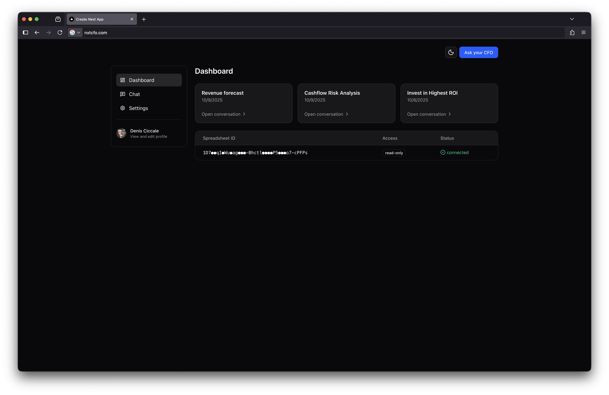
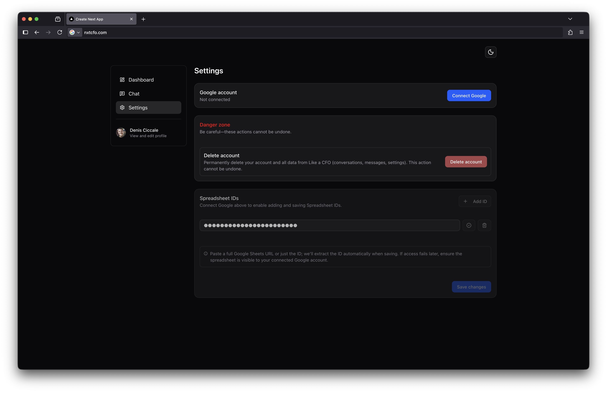
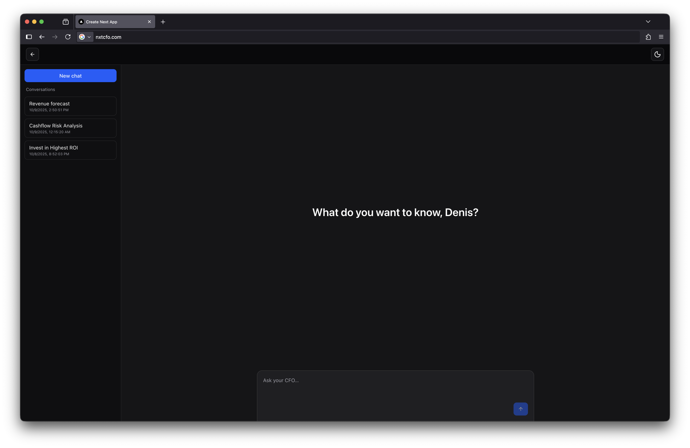
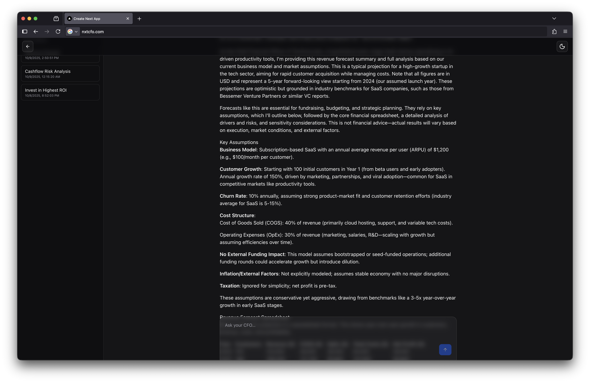

# NxtCFO

## Ask your spreadsheets anything.

NxtCFO — an AI chat that reads your Google Sheets to answer questions, forecast runway and MRR, and generate financial
reports.

## Proof of Concept

This is a proof of concept project demonstrating how to connect a Google Sheets document to an AI language model (like
OpenAI's GPT-5) to create an interactive chat interface for querying and analyzing spreadsheet data.

The code is not the cleanest or most efficient, but it serves as a starting point to showcase the concept.

### Screenshots

### Notes

Developer metadata could be useful to annotate the excel for faster lookups

https://developers.google.com/workspace/sheets/api/reference/rest/v4/spreadsheets.developerMetadata
